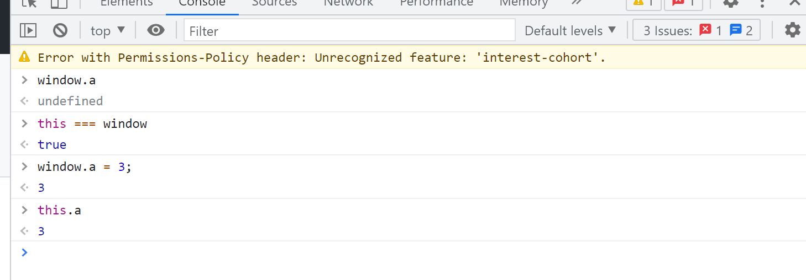
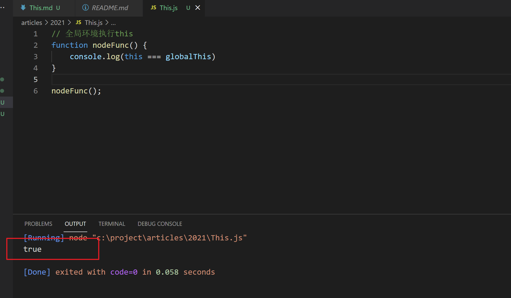
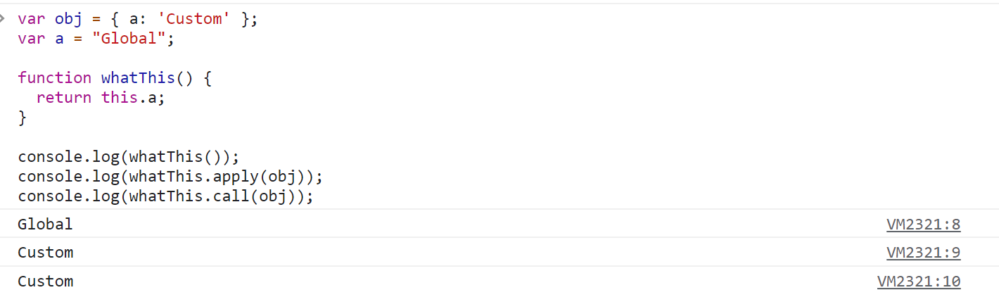

# this

# 前言

我相信大家在平常的编码和面试中会遇到关于this指向的问题，虽然ES6加入了箭头函数，但是很多开源代码还是采用了this的写法，每当看到源码的this指向总会一脸懵逼，所以今天我们花一点时间来了解一下this到底是什么，在实际的应用中会有什么样的用处

# 什么是this

参考资料

[https://developer.mozilla.org/zh-CN/docs/Web/JavaScript/Reference/Operators/this](https://developer.mozilla.org/zh-CN/docs/Web/JavaScript/Reference/Operators/this)
MDN的解释如下：

当前执行上下文（global、function 或 eval）的一个属性，在非严格模式下，总是指向一个对象，在严格模式下可以是任意值。

我个人的理解是当前代码运行的一个空间，可以通过this获取这个空间内的各种属性，包括变量，函数，根据当前运行代码环境的不同会指向不一样的空间

## 全局上下文

当我们在浏览器的全局环境中执行this，那么这个this就等同于window



## 函数上下文

如果在函数内部，this的值取决于被调用的方式

在node函数中，指向globalThis，这和当前函数外的this不同，module.exports === this，这里具体不展开，可以参考下面这个文章

[https://blog.csdn.net/nullccc/article/details/108931703](https://blog.csdn.net/nullccc/article/details/108931703)



可以看到在浏览器中，如果什么都不做，那么在全局环境中这个函数的this就是指向window，如果我们通过apply和call改变了当前this的指向，那么this就指向我们特定给的值



## 改变this指向的三种方法

### call,apply

```jsx
var person = {
  name: "lemon tree",
  age: 25,
};
function say(job) {
  console.log(this.name + ":" + this.age + " " + job);
}
say.call(person, "test"); // lemon tree:25 test
say.apply(person, ["test"]); // lemon tree:25 test
```

call是将剩余的参数作为函数的参数，apply第二个参数是一个数组，数组每一个参数对应函数的参数

### bind

ECMAScript 5 引入了 `[Function.prototype.bind()](https://developer.mozilla.org/zh-CN/docs/Web/JavaScript/Reference/Global_Objects/Function/bind)`。调用`f.bind(someObject)`会创建一个与`f`具有相同函数体和作用域的函数，但是在这个新函数中，`this`将永久地被绑定到了`bind`的第一个参数，无论这个函数是如何被调用的。

```jsx
function f() {
  return this.a;
}
var g = f.bind({ a: "test" });
console.log(g()) // test

var h = g.bind({ a: "123" });
console.log(h()) // test
```

可以看到g已经被绑定一次之后再绑定就无效了

## 箭头函数

箭头函数是ES6的新特性，自身没有this，如果代码使用了this会向最靠近的this取值

```jsx
var globalObject = this;
var foo = (() => this);
console.log(foo() === globalObject); // true
```

下面这个例子，一个赋值给了 `obj.bar`的函数（称为匿名函数 A），返回了另一个箭头函数（称为匿名函数 B）。因此，在 `A` 调用时，函数B的`this`被永久设置为obj.bar（函数A）的`this`。当返回的函数（函数B）被调用时，它`this`始终是最初设置的。在上面的代码示例中，函数B的`this`被设置为函数A的`this`，即obj，所以即使被调用的方式通常将其设置为 `undefined` 或全局对象（或者如前面示例中的其他全局执行环境中的方法），它的 `this` 也仍然是 `obj` 。

```jsx
// 创建一个含有bar方法的obj对象，
// bar返回一个函数，
// 这个函数返回this，
// 这个返回的函数是以箭头函数创建的，
// 所以它的this被永久绑定到了它外层函数的this。
// bar的值可以在调用中设置，这反过来又设置了返回函数的值。
var obj = {
  bar: function () {
    var x = () => this;
    return x;
  },
};

// 作为obj对象的一个方法来调用bar，把它的this绑定到obj。
// 将返回的函数的引用赋值给fn。
var fn = obj.bar();

// 直接调用fn而不设置this，
// 通常(即不使用箭头函数的情况)默认为全局对象
// 若在严格模式则为undefined
console.log(fn() === obj); // true

// 但是注意，如果你只是引用obj的方法，
// 而没有调用它
var fn2 = obj.bar;
// 那么调用箭头函数后，this指向window，因为它从 bar 继承了this。
console.log(fn2()() == window); // true
```

## 作为对象的方法

下面的例子中，当 `o.f()` 被调用时，函数内的 `this` 将绑定到 `o` 对象。

 当函数作为对象里的方法被调用时，`this` 被设置为调用该函数的对象。

```jsx
var o = {
  prop: 37,
  f: function() {
    return this.prop;
  }
};

console.log(o.f()); // 37
```

## 原型链中的this

对于在对象圆形上某处定义的方法，同样的概念也适用，如果该方法存在于一个对象的原型链上，那么this指向的是调用这个方法的对象，就像该方法就在这个对象上一样

```jsx
var o = {
  f: function () {
    return this.a + this.b;
  },
};
var p = Object.create(o);
p.a = 1;
p.b = 4;

console.log(p.f()); // 5
```

### 作为一个构造函数

当一个函数用作构造函数时（使用[new](https://developer.mozilla.org/zh-CN/docs/Web/JavaScript/Reference/Operators/new)关键字），它的`this`被绑定到正在构造的新对象

虽然构造函数返回的默认值是 `this` 所指的那个对象，但它仍可以手动返回其他的对象（如果返回值不是一个对象，则返回 `this` 对象）。

```jsx
/*
 * 构造函数这样工作:
 *
 * function MyConstructor(){
 *   // 函数实体写在这里
 *   // 根据需要在this上创建属性，然后赋值给它们，比如：
 *   this.fum = "nom";
 *   // 等等...
 *
 *   // 如果函数具有返回对象的return语句，
 *   // 则该对象将是 new 表达式的结果。
 *   // 否则，表达式的结果是当前绑定到 this 的对象。
 *   //（即通常看到的常见情况）。
 * }
 */

function C(){
  this.a = 37;
}

var o = new C();
console.log(o.a); // logs 37

function C2(){
  this.a = 37;
  return {a:38};
}

o = new C2();
console.log(o.a); // logs 38
```

在刚刚的例子中（`C2`），因为在调用构造函数的过程中，手动的设置了返回对象，与`this`绑定的默认对象被丢弃了。（这基本上使得语句 “`this.a = 37;`”成了“僵尸”代码，实际上并不是真正的“僵尸”，这条语句执行了，但是对于外部没有任何影响，因此完全可以忽略它）。

### 作为一个DOM事件处理函数

当函数被用作事件处理函数时，它的 `this` 指向触发事件的元素（一些浏览器在使用非 `addEventListener` 的函数动态地添加监听函数时不遵守这个约定）

```jsx
// 被调用时，将关联的元素变成蓝色
function bluify(e){
  console.log(this === e.currentTarget); // 总是 true

  // 当 currentTarget 和 target 是同一个对象时为 true
  console.log(this === e.target);
  this.style.backgroundColor = '#A5D9F3';
}

// 获取文档中的所有元素的列表
var elements = document.getElementsByTagName('*');

// 将bluify作为元素的点击监听函数，当元素被点击时，就会变成蓝色
for(var i=0 ; i<elements.length ; i++){
  elements[i].addEventListener('click', bluify, false);
}
```

## 作为一个内联事件处理函数

当代码被内联 [on-event 处理函数 (en-US)](https://developer.mozilla.org/en-US/docs/Web/Events/Event_handlers) 调用时，它的`this`指向监听器所在的DOM元素：

```jsx
<button onclick="alert(this.tagName.toLowerCase());">
  Show this
</button>
```

# 总结

如果要判断一个函数的this绑定，就需要找到这个函数的直接调用位置，然后可以顺序按照下面四条规则来判断this的绑定对象

1. 由new调用的构造函数，绑定到新创建的对象
2. 由call、apply或者bind调用，绑定到指定的对象
3. 由上下文确定对象调用：绑定到上下文对象
4. 默认：全局对象

注意：箭头函数不适用上面的绑定规则，根据外层作用域来决定this的指向，继承外层函数调用的this绑定