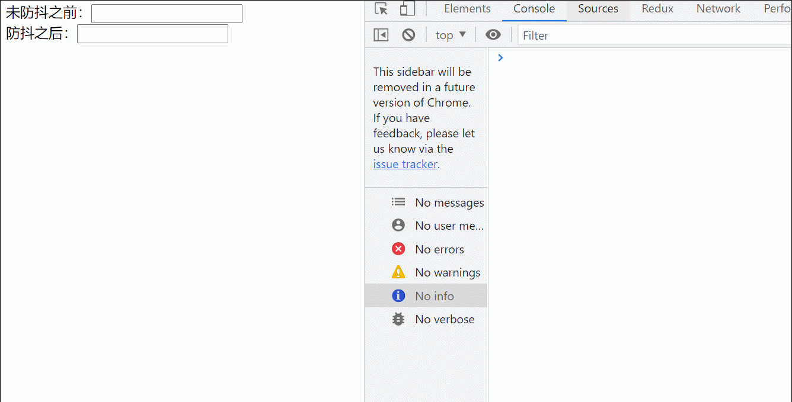
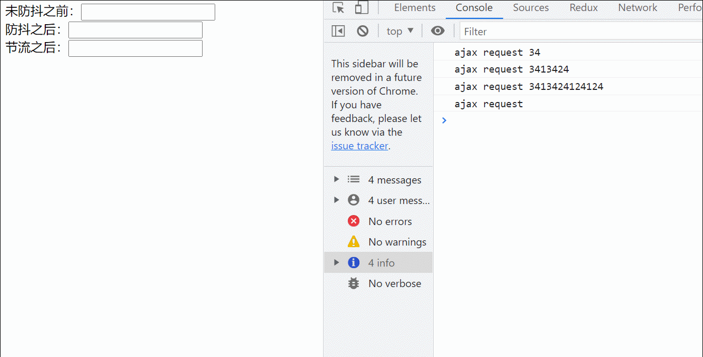

# 防抖和节流

# 前言

函数防抖(debounce)：在事件触发n秒后再执行回调，如果在这n秒内又被触发，则重新计时

函数节流(throttle)：规定在一个单位世间内，只能触发一次函数，如果这个单位时间内多次触发函数，只有一次生效

# 防抖

没有进行防抖之前的代码和效果

```jsx
function getIdElement(id) {
      return document.getElementById(id);
    }

    //模拟一段ajax请求
    function ajax(content) {
      console.log("ajax request " + content);
    }

    const debounceBefore = getIdElement("debounceBefore");
    debounceBefore.addEventListener("keyup", function (e) {
      ajax(e.target.value);
    });
```


防抖之后

```jsx
function debounce(func, delay) {
        return function(args){
            let that = this;
            let _args = args;
            clearTimeout(func.id);
            func.id = setTimeout(function(){
              func.call(that, _args)
            }, delay)
        }
    }

    const debounceAfter = getIdElement("debounceAfter");
    let debounceAjax = debounce(ajax, 500);
    debounceAfter.addEventListener("keyup", function (e) {
       debounceAjax(e.target.value)
    })
```



可以看到修改之后，只有在最后一次输入500毫秒之后才执行对应函数，如果中途输入则会重新计时，防抖函数是通过闭包实现的

## 实际应用

1. 输入框实时请求后端数据
2. 鼠标滑动事件

# 节流

```jsx
function throttle(func, time) {
      let timer = null;
      return function (args) {
        let that = this;
        let _args = args;
        if (timer === null) {
          timer = setTimeout(function () {
            func.call(that, _args);
            timer = null;
          }, time);
        }
      };
    }

    const throttleAfter = getIdElement("throttleAfter");
    let throttleAjax = throttle(ajax, 1000);
    throttleAfter.addEventListener("keyup", function (e) {
      throttleAjax(e.target.value);
    });
```



可以看到，节流之后的输入框，在规定时间内只会执行一次函数

## 实际应用

1. 运维系统查看应用运行日志时，每 n 秒刷新一次
2. scroll 事件，每隔一秒计算一次位置信息等
3. 浏览器播放事件，每个一秒计算一次进度信息等